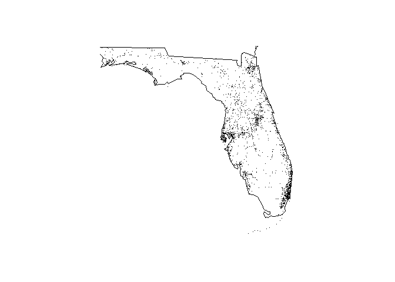

<!-- README.md is generated from README.Rmd. Please edit that file -->
This package serves nothing but to pass Peer-graded Assignment: Building an R Package.

Continuous Integration status
-----------------------------

Travis Build: [](https://travis-ci.org/azerbinati/courseraPack) Appveyor Build: [](https://ci.appveyor.com/project/azerbinati/courserapack)

Assignment Info
---------------

This assessment will ask reviewers the following questions:

-   Does this package contain the correct R file(s) under the R/ directory?
-   Does this package contain a man/ directory with corresponding documentation files?
-   Does this package contain a vignette which provides a meaningful description of the package and how it should be used?
-   Does this package have at least one test included in the tests/ directory?
-   Does this package have a NAMESPACE file?
-   Does the README.md file for this directory have a Travis badge?
-   Is the build of this package passing on Travis?
-   Are the build logs for this package on Travis free of any errors, warnings, or notes?

Functions
---------

In this package You'll find the following functions fars family function.

`courseraPack::fars_read(filename)`

`courseraPack::fars_map_state(state.num,year)`

Maps
----

This package is also able to plot this datas on a map as shown below

``` r

 fars_map_state(12,2014)
 
```


